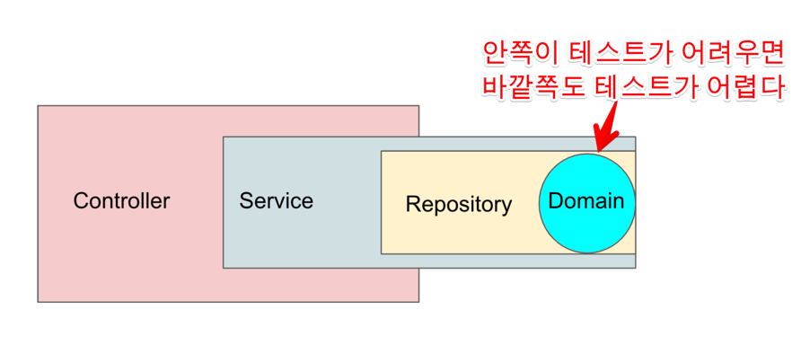
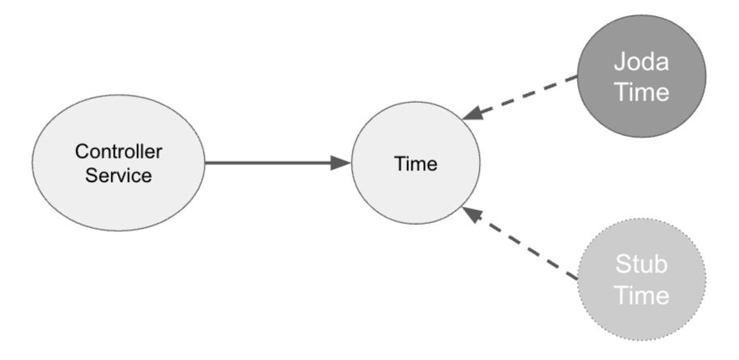

# Testable Code

<!-- TOC -->
* [Testable Code](#testable-code)
  * [1️⃣ 테스트 하기 어려운 코드](#1-테스트-하기-어려운-코드)
  * [2️⃣ 테스트 하기 좋은 코드](#2-테스트-하기-좋은-코드)
  * [3️⃣ 같은 결과가 나오기 힘든 케이스](#3-같은-결과가-나오기-힘든-케이스)
    * [제어할 수 없는 값에 의존](#제어할-수-없는-값에-의존)
    * [외부에 영향을 주는 코드](#외부에-영향을-주는-코드)
  * [4️⃣ 테스트 코드에 대해 자주하는 질문](#4-테스트-코드에-대해-자주하는-질문)
    * [private 메서드는 테스트를 안해도 되는가?](#private-메서드는-테스트를-안해도-되는가)
    * [테스트에서만 필요한데 프로덕션 코드에서는 필요 없다면?](#테스트에서만-필요한데-프로덕션-코드에서는-필요-없다면)
    * [참고](#참고)
<!-- TOC -->

## 1️⃣ 테스트 하기 어려운 코드

보통 테스트를 작성하기 어려운 구현체 때문에 테스트 코드를 작성하기 어렵다.

+ 테스트 코드는 프로덕션 코드의 보조수단이 아니라 같은 레벨로 봐야한다.
+ 테스트 코드는 구현 설계 Smell을 맡게해주는 좋은 수단
+ 좋은 디자인으로 구현된 코드는 대부분 테스트 하기가 쉽다.
+ 반면에, 테스트가 어려운 코드는 확장성 / 의존성 등 코드 디자인, 설계가 잘못되었을 확률이 높다..

## 2️⃣ 테스트 하기 좋은 코드

**테스트 하기 좋은 코드는 몇번을 수행해도 항상 같은 결과가 반환되는 함수이다! 👍**

## 3️⃣ 같은 결과가 나오기 힘든 케이스

### 제어할 수 없는 값에 의존

1. 문제 파악

    + Random(), new Date(), LocalDate.now() 같이 실행할때마다 결과가 다른 케이스
    + readLine() 등 사용자들의 입력에 의존
    + 전역함수, 전역변수에 의존
    + 외부 SDK에 의존하는 경우

    ```java
    public class Order {
        
        public void cancel() {
            LocalDateTime now = LocalDateTime.now(); // 실행할 때마다 결과가 다른 이유
            if (this.orderDateTime > now) {
                throw new IllegalArgumentException("주문 시간이 주문 취소 시간보다 늦을 수 없습니다.");
            }
   
            ...
        }    
    }
    ``` 
   위의 코드는 항상 결과가 똑같은 형태의 메서드로 전환이 필요하다. (위와 같은 코드가 **도메인 로직**안에 내포되어 있다면, 모든 레이어가 테스트 하기 어려워질 것 이다.)

2. 해결 방법

   생성자, 함수의 인자로 테스트하기 어려운 코드의 결과를 받는 것이다. 즉, 제어할 수 없는 값을 외부에서 주입받는다.

    ```java
    public class Order {
        
        public void cancel(LocalDateTime cancelDateTime) { // 외부에서 주입받는 방식으로 변경
            if (this.orderDateTime > cancelDateTime) { 
                throw new IllegalArgumentException("주문 시간이 주문 취소 시간보다 늦을 수 없습니다.");
            }
   
            ...
        }    
    }
    ```

   **외부에서 주입 받기위해 함수의 인자가 많아지는 경우**

    + DTO 패턴으로 변경
    + 생성자 주입을 받아서 사용
    + 함수 인자의 기본 값 사용

   **가장 바깥쪽으로 밀어내기**  
   의존하는 코드가 가장 적은 영역까지 밀어내는 것이 좋다. 제어할 수 없는 코드를 바깥으로 밀어내, 해당 코드에 의존하는 범위를 좁히는 것 (Controller 까지 밀어내는 것이 가장 쉬운 방법)   
   

    ```java
    public class OrderController {
   
        private final OrderService orderService;
   
        @PutMapping("/api/v1/orders/cancel/{id}")
        public ApiResponse<?> cancel(@PahtVariable Long id) {
            orderService.cancel(id, LocalDateTime.now()); // Controller 레이어까지 밀어낸다. 
            return ApiResponse.success();
        }    
    }
    ```

   **의존성 주입**  
   제어할 수 없는 값을 반환하는 인터페이스를 두고, 이를 테스트와 프로덕션 코드에서 활용 (테스트 더블)
   
    ```java
    import java.time.LocalDateTime;public interface OrderCancelDateTimeProvidable {
   
        LocalDateTime now(); 
    }
   
    public class CurrentTimeCancelDateTimeProvider implements OrderCancelDateTimeProvidable {
   
        @Override 
        public LocalDateTime now() {
            return LocalDateTime.now();
        }
    }
   
    public class StubCancelDateTimeProvider implements OrderCancelDateTimeProvidable {
   
        private final LocalDateTime dateTime;
   
        private StubCancelDateTimeProvider(LocalDateTime dateTime) {
            this.dateTime = dateTime;
        }    
   
        public static StubCancelDateTimeProvider of(LocalDateTime dateTime) {
            return new StubCancelDateTimeProvider(dateTime);
        }
   
        @Override 
        public LocalDateTime now() {
            return dateTime;
        }
    }
    ```

### 외부에 영향을 주는 코드

1. 문제 파악

    + console.log, sout과 같은 표준 출력
    + Logger 사용
    + 이메일 발송, 메세지 큐 등 외부로의 메세지 발송
    + **데이터베이스 의존**
    + 외부 API에 의존

    ```java
    public class Order {
        
        public void cancel(LocalDateTime cancelDateTime) { 
            if (this.orderDateTime > cancelDateTime) { 
                throw new IllegalArgumentException("주문 시간이 주문 취소 시간보다 늦을 수 없습니다.");
            }
            Order cancelOrder = new Order();
            cancelOrder.status = OrderStatus.CANCEL;
            cancelOrder.orderDateTime = cancelDateTime;
            cancelOrder.amount = this.amount * -1;
            
            orderRepository.save(cancelOrder); // DB 저장 로직의 개입.. 테스트가 어려워진다.. 
        }    
    }
    ```

   데이터베이스가 개입되는 순간, 테스트 하기 어려워진다.

    + 매 테스트 마다 테이블 스키마 필요
    + 테스트를 수행하기 위해 데이터 적재 / 테스트 환경 필요
    + 테스트가 끝날때마다 사용된 테이블을 초기화하여 다음 테스트에 영향을 끼치지 않도록 제어
    + 테스트가 느려진다.

   > 로직 안에 외부 의존성이 포함되어있다..

2. 해결 방법

   외부 의존성을 로직에서 제외시킨다. 리턴 값이 있는 메서드로 만든다.

    ```java
    public class OrderService { 
        
        public void cancel(Long id, LocalDateTime cancelDateTime) {
            Order order = orderRepository.findById(id);
            Order cancelOrder = order.cancel(cancelDateTime);
            orderRepository.save(cancelOrder); // 외부 의존성을 도메인 레이어가 아닌 서비스 레이어로 제외시킨다.
        }
    }
   
    public class Order {
        
        public Order cancel(LocalDateTime cancelDateTime) { 
            if (this.orderDateTime > cancelDateTime) { 
                throw new IllegalArgumentException("주문 시간이 주문 취소 시간보다 늦을 수 없습니다.");
            }
            Order cancelOrder = new Order();
            cancelOrder.status = OrderStatus.CANCEL;
            cancelOrder.orderDateTime = cancelDateTime;
            cancelOrder.amount = this.amount * -1;
            
            return cancelOrder; // 리턴 값이 있는 메서드로 만들면서 테스트하기 용이해진다.
        }    
    }
    ```

## 4️⃣ 테스트 코드에 대해 자주하는 질문

### private 메서드는 테스트를 안해도 되는가?

결론부터 말하면, 안해도 된다. 하지만 욕망이 강하다면, 객체 분리의 신호이다.

다음은 서비스 레이어의 API로 받은 요청 값을 검증하고 DB에 저장하는 코드가 있다.

```java
public class ProductService {

    public ProductResponse create(String name, int price) {
        validateName(name);
        validatePrice(price);

        Product product = Product.of(name, price);

        return ProductReponse.of(productRepository.save(product));
    }

    private void validateName(String name) {
        if (name.isBlank()) {
            throw new IllegalArgumentException("상품명은 필수입니다.");
        }
    }

    private void validatePrice(int price) {
        if (price < 0) {
            throw new IllegalArgumentException("상품 금액은 0이상이여야 합니다.");
        }
    }
}
```

위의 private 메서드를 테스트 하고 싶은 욕망이 강하다면 도메인 클래스에 위임한다.

```java
public class ProductService {

    public ProductResponse create(String name, int price) {
        Product product = Product.of(name, price);

        return ProductReponse.of(productRepository.save(product));
    }
}

public class Product {

    public Product(String name, int price) {
        validateName(name);
        validatePrice(price);

        this.name = name;
        this.price = price;
    }

    public static Product of(String name, int price) {
        return new Product(name, price);
    }

    private void validateName(String name) {
        if (name.isBlank()) {
            throw new IllegalArgumentException("상품명은 필수입니다.");
        }
    }

    private void validatePrice(int price) {
        if (price < 0) {
            throw new IllegalArgumentException("상품 금액은 0이상이여야 합니다.");
        }
    }
}
```

만약 다른 도메인(주문, 정산)에서도 validatePrice를 사용한다면 Price로 객체를 분리해서 사용해도 좋다.

### 테스트에서만 필요한데 프로덕션 코드에서는 필요 없다면?

예를들면, Controller에서 직접 들어오는 DTO의 빌더 패턴은 주로 프로덕션에서 사용하지 않는다.

결론은 만들어도 되나, 보수적으로 접근해야한다.

### 참고

https://jojoldu.tistory.com/674  
https://www.inflearn.com/course/practical-testing-%EC%8B%A4%EC%9A%A9%EC%A0%81%EC%9D%B8-%ED%85%8C%EC%8A%A4%ED%8A%B8-%EA%B0%80%EC%9D%B4%EB%93%9C/dashboard


